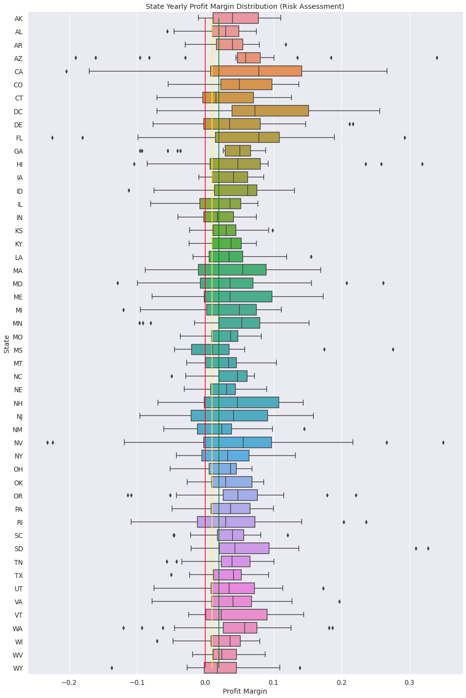
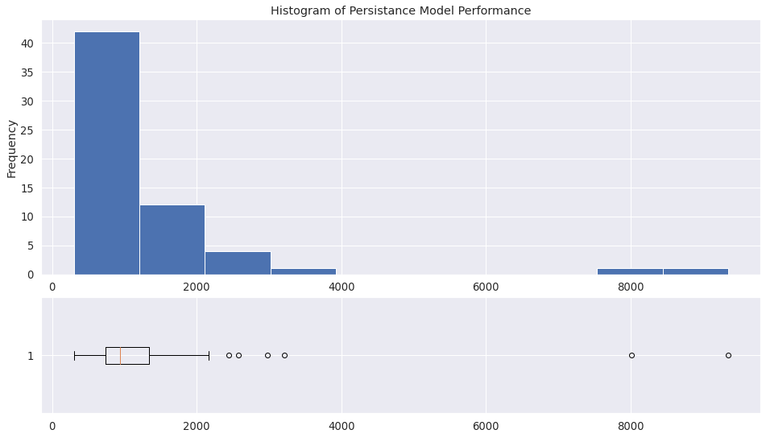

[](https://mybinder.org/v2/gh/Skellet0r/realty-forecast/master)

# Forecasting Real Estate Value

Our client for this project is XYZ Realty, LLC. They're primarily
a real estate company based in the west coast. They make profits
by "flipping" houses, that is buying a house at a low value and
selling at a higher value.  
XYZ Realty, LLC, is seeking to expand their portfolio, and are
looking for areas in the United States with the best opportunity for
them to make a profit. They have asked a pretty open ended question,
what are the 5 best zip codes?

## Components

- [Charter](docs/project/charter.md): the project charter was the first step when starting this project,
  and is a sort of outline of this project. It clarifies who our stakeholders are, what we aim to do, and
  how we intend to complete this project. If this is your first time looking at this project, the project
  charter is the best place to start.
- [Conclusion/Exit Report](docs/project/exit-report.md): an outline of this project's end results, it provides
  an overview mainly for a technical audience at the conclusion of the project.
- [Data](data/): this is typically where data used in this project is stored. For large datasets which can't
  be stored within the repository due to their massive size, steps will be given to import the data.
- [Data Dictionaries](docs/data_dictionaries): any custom or client delivered data dictionaries can be found here.
- [Notebooks](notebooks/): this is where all the jupyter notebooks for this project are stored.
  Instead of having one behemoth of a jupyter notebook, there are multiple distinct notebooks each
  focusing on a different phase of the project. A majority of the notebooks focus on modeling and using different
  classifiers. Each notebook is numbered in the order they were completed, this keeps everything in a linear order.
- [Source Code](src/): this is were custom python functions/variables are stored that are used throughout the project.
  It is installed into the conda environment when you first create the environment, and any changes automagically appear.
- [Project Environment](environment.yml): to enable reproducibility of the project environment I recommend you use the
  environment.yml file along with anaconda. However there is also an alternative requirements.txt file in the event
  that one is unable to access/install anaconda. Reproducing the same environment allows for consistent results.
- [Presentation](https://Skellet0r.github.io/realty-forecast): The presentation deliverd to stakeholders for this project.

## Quick Start

If you want your own local instance of this project follow the steps below.

1. Clone this repository

```shell
$ git clone https://github.com/Skellet0r/realty-forecast.git
```

2. Initialize the environment

```shell
$ cd ./realty-forecast
$ conda env create -f environment.yml
```

3. Activate the environment

```shell
$ conda activate realty-forecast
```

4. Enjoy 😃

> If you'd like to interactively inspect this project, and don't have access to a terminal, anaconda, or pip.
> Click the `launch binder` tag.

## Findings

Our findings are as follows:

1. The national housing market trends positively.


2. The annual net profit margin for each state varies, no market is without risk, but certain markets are historically safer, relatively speaking.



3. Both DC and CO are excellent markets but there is more opportunity in Colorado.
4. We have to do second order differencing on most time series.
5. Our baseline persistence model faired badly.



6. Of the markets in the State of Colorado, we've noticed that most use an p term of 2, a d term of 2, and a q term above 5. ARIMA(2, 2, 5) typically.


## Recommendations

From our SARIMA/ARIMA Modeling we found the 5 zip codes we've determined to be the best investment. They justifiably balance minimizing risk while
also maximizing net profit. We therefore recommend that XYZ Realty LLC, invest in the following 5 zip codes.

|     | ZipCode |     RMSE | Historic Median Value | Proj. Min Value (12m) | Proj. Max Value (12m) | Proj. Min Net Profit | Proj. Max Net Profit |
| --: | ------: | -------: | --------------------: | --------------------: | --------------------: | -------------------: | -------------------: |
|   1 |   80203 | 15,517.8 |             \$571,500 |             \$632,029 |             \$707,771 |           \$60,529.4 |            \$136,271 |
|   2 |   80218 | 28,192.7 |             \$773,400 |             \$868,125 |             \$961,875 |           \$94,725.4 |            \$188,475 |
|   3 |   80211 | 29,628.8 |             \$546,600 |             \$592,347 |             \$644,853 |           \$45,746.9 |           \$98,253.1 |
|   4 |   80220 | 31,763.1 |             \$561,100 |             \$609,286 |             \$664,114 |           \$48,186.1 |            \$103,014 |
|   5 |   80212 | 49,685.4 |             \$510,000 |             \$571,192 |             \$628,808 |           \$61,192.4 |            \$118,808 |

## Next Steps

Moving forward we'd like to expend our modeling to include the entire state of Colorado. We especially would like to further expand by
using distributed compute technology to forecast for a multitude of zip codes in parallel (greatly reducing time cost and resource consumption).
Lastly, we'd like to look at the impact of neighboring zipcodes on the historic valuation of individual zip codes. If we can identify a pattern
or uptrend amongst a collection of zip codes, we could apply it in the future to identify opportunity.
